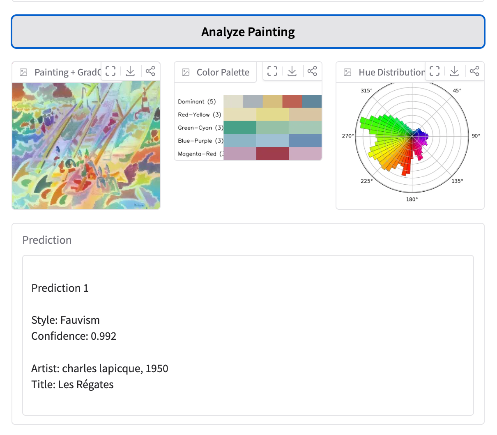

# Boni's Painting Style Analysis

## demo url
[bleemcfadden/painting-style-analyser](https://huggingface.co/spaces/bleemcfadden/painting-style-analyser)
This model can predict up to 5 images in one upload.

## Impressionism, Fauvism, and Art Nouveau (1860-1920)
**Sequential Convoluted Neural Networks Classification**

This project develops a computer vision system for classifying painting styles using CNN. The objective is to distinguish among three artistic movements—Impressionism, Fauvism, and Art Nouveau Modern—by learning visual cues such as color composition, texture, and structural elements present in the artworks. 

A baseline model was first implemented to establish a reference performance by learning features directly from the dataset. Subsequently, transfer learning was applied using a pretrained EfficientNet architecture, allowing the model to leverage rich visual representations learned from large-scale image datasets. Fine-tuning was then conducted by unfreezing selected layers of the pretrained backbone to further adapt the feature representations to the stylistic characteristics of the target painting classes. The final chosen model was TransferLearning due to its stability in improvement over baseline model.

Model performance was evaluated using metrics including accuracy, log loss, and selective prediction analysis. Additionally, a confidence-based thresholding mechanism was implemented to enable the model to abstain from uncertain predictions, improving reliability while maintaining approximately 80% coverage. This model is able to label classifications into the 3 styles AND unknown labels. With confidence threshold of 59%, using 5 art-styles (3 from our classification plus Post-Impressionism and Realism), our model can detect 19% of unknown paintings accurately. On the other hand, for the known classes, accuracy was at 75%. 

## Workflow Structures
Below is the process on how I do this project. 
1. **Problem Analysis** regarding visual art and history, includes: the objectives, dataset, and unit analysis.

2. **Methodology Design**, specifying the sample, artist cap, dataset curation. 

3. **Modelling**. Planning the training iteration, controlling randomness. Using 3 models: **baseline**, **transfer learning**, **tuned transfer learning**. Evaluation on best model is based on models' internal metrics and stability. 

4. **Model Analysis**. Here, I evaluate the chosen TL model (in comparison to the baseline model) including explaining the visual cues of each classes, both in this project's split and historically. Following that, I conducted **GradCAM** analysis to see the "feature importance" to explain what cues are learnt by the model. After that, **error analysis** was done to explain how misclassifications are made. To support my explanation, I added **PCA and t-SNE** to see the shared factors and similarities between the groups. Here, I also exploring threshold for the model application and considering future improvement for the model.

5. **Infererence and Deployment**. We tested the models on batch data, and later added chromatic analysis for each picture. For deployment, I also added GradCAM overlay to see what part of the painting made it classified as so, the pallette strips, and hue wheel distribution. 

**Boni's Note:**
It is to be remembered that hue wheel ONLY maps the hue component, not saturation or brightness. Plus, I haven't thought of a better way to normalised the frequency of hues distribution (because each colors has different value, so some colors will always have higher weight than others). Anyway, so hue wheels can look off because of many factors, mainly due to mathematical issue. It is quite accurate for most, but when the painting is dominated with one hue, it can leaked weirdly (e.g blue/green is counted as magenta).
